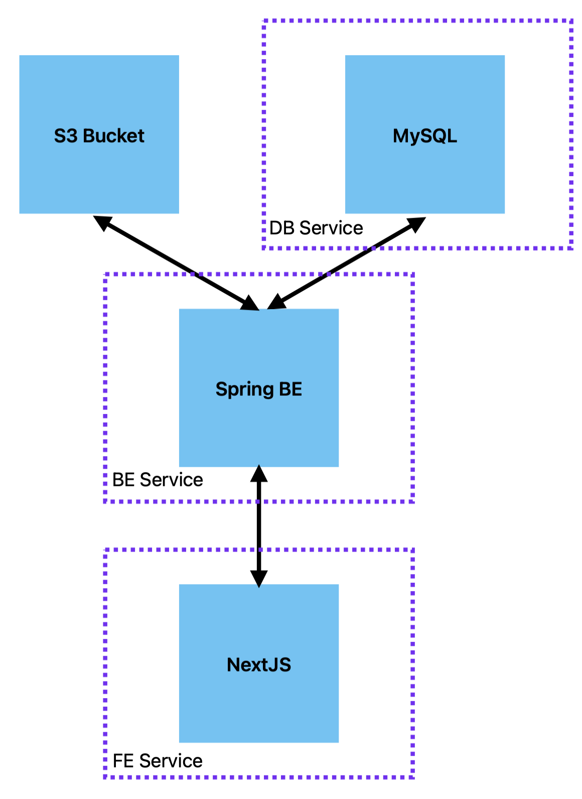

# myMag

This repository is meant to clone eMag marketplace as a practice project for full stack development.

## Application architecture



In order to run the monorepo in development use docker compose to build and run the services:

```bash
docker compose up
```

## WIP

CI/CD to be done with GitHub Actions
Upload the docker images to a registry
Deployment to a cloud provider
